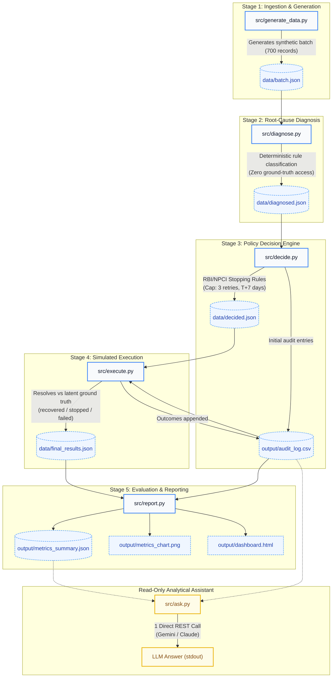

# AI Revenue Recovery Agent

**Razorpay AI Buildathon — Track 03: AI Revenue Recovery**

> An autonomous, compliance-bounded pipeline that diagnoses failed subscription/mandate payments, selects the optimal recovery intervention, simulates execution, and produces a full audit trail and executive dashboard — entirely without an LLM, database, or web framework.

---

## Table of Contents

1. [Problem Statement](#problem-statement)
2. [Architecture — 5-Stage Pipeline](#architecture--5-stage-pipeline)
3. [Project Structure](#project-structure)
4. [How to Run](#how-to-run)
5. [Final Metrics](#final-metrics)
6. [Compliance Note — Stopping Rules](#compliance-note--stopping-rules)
7. [Known Limitations](#known-limitations)

---

## Problem Statement

Recurring subscription payments in India fail for a variety of reasons — insufficient funds, expired mandates, instrument expiry, transient bank errors, and fraud/risk holds. Each failure is a direct revenue loss for the merchant and a churn risk for the platform. Yet not all failures are equally recoverable: blindly retrying every failed payment wastes gateway fees, risks further customer friction, and — critically — violates RBI and NPCI guidelines on e-mandate retry windows.

**Track 03** of the Razorpay AI Buildathon challenges participants to build an intelligent recovery agent that:

- Autonomously classifies the root cause of each failure
- Selects the most appropriate intervention (retry, re-authentication, instrument update, or graceful winback)
- Respects regulatory retry constraints without human intervention
- Produces a fully auditable outcome log and financial impact report

This project implements that agent as a deterministic, rule-based Python pipeline — no LLM calls, no agent frameworks, no database.

---

## Architecture — 5-Stage Pipeline



### Stage 1 — Generate (`src/generate_data.py`)

Produces a synthetic batch of subscription payment records in `data/batch.json`. Each record carries a `status` (success or failed), a `failure_reason_code` drawn from six real-world categories (`insufficient_funds`, `mandate_expired`, `mandate_revoked`, `bank_technical_decline`, `instrument_expired`, `risk_block`), financial fields (`amount_inr`, `currency`), retry history (`retry_attempt_number`, `first_attempt_date`, `last_attempt_date`), and latent ground-truth recoverability flags (`ground_truth_recoverable`, `ground_truth_recovery_probability`) that are **only ever read in Stages 4-5** — never in diagnosis or decision logic. The batch size is set to 700 records with a ~10.7% synthetic failure rate.

### Stage 2 — Diagnose (`src/diagnose.py`)

Reads `data/batch.json` and applies a deterministic, rule-based classifier to each failed record, writing results to `data/diagnosed.json`. The classifier maps `failure_reason_code` to one of five canonical root causes: `funding_shortfall`, `mandate_lifecycle`, `transient_bank_error`, `payment_instrument_issue`, or `fraud_or_risk_hold`. Crucially, this stage has **zero access to any `ground_truth_*` field** — diagnosis is based solely on observable transaction metadata, exactly as a production system would operate.

### Stage 3 — Decide (`src/decide.py`)

Reads `data/diagnosed.json` and runs each failed record through an intervention decision engine, writing decisions to `data/decided.json` and the initial audit log to `output/audit_log.csv`. The engine maps each diagnosed cause to one of six recovery actions: `immediate_retry_once`, `retry_scheduled`, `reauth_request`, `update_payment_method_request`, `no_retry_winback_offer`, or `manual_review_escalation`. Before assigning any retry action, two hard compliance stops are enforced: if `retry_attempt_number >= 3` (max-attempt cap) or if the time since first attempt exceeds 7 days (RBI/NPCI e-mandate retry window), the record is marked `recovery_abandoned` — regardless of estimated recoverability. This behaviour is intentional and non-negotiable (see Compliance Note).

### Stage 4 — Execute (`src/execute.py`)

Reads `data/decided.json` and simulates the execution of each chosen intervention with realistic timing offsets: `immediate_retry_once` executes at T+0, `reauth_request` at T+2 days, and `retry_scheduled`/`update_payment_method_request` at T+3 days. Terminal actions (`recovery_abandoned`, `no_retry_winback_offer`, `manual_review_escalation`) are logged without execution. For active interventions, the stage resolves outcomes against the latent ground-truth fields — the only stage that may legitimately read `ground_truth_*`. Each record is classified as `recovered`, `still_failed`, or `correctly_stopped`, and outcomes are appended to `output/audit_log.csv`. Full results are written to `data/final_results.json`.

### Stage 5 — Report (`src/report.py`)

Reads `output/audit_log.csv` and `data/final_results.json` to compute the full financial impact report. Calculates revenue at risk, recovered amount, recovery rate, false-positive retry costs, missed recovery opportunities, and net recovery value. Outputs include a matplotlib bar chart (`output/metrics_chart.png`), a structured JSON summary (`output/metrics_summary.json`), and a regenerated self-contained executive dashboard (`output/dashboard.html`) with all current-run data embedded — so the dashboard is always current after any pipeline run.

---

## Project Structure

```
AI Agent/
+-- src/
|   +-- generate_data.py   # Stage 1 -- synthetic batch generation
|   +-- diagnose.py        # Stage 2 -- root-cause classification
|   +-- decide.py          # Stage 3 -- intervention decision engine
|   +-- execute.py         # Stage 4 -- simulated execution & outcome resolution
|   +-- report.py          # Stage 5 -- metrics, chart, JSON, dashboard
|   \-- ask.py             # Read-only analytical Q&A assistant (Gemini / Claude)
+-- data/
|   +-- batch.json         # Output of Stage 1
|   +-- diagnosed.json     # Output of Stage 2
|   +-- decided.json       # Output of Stage 3
|   \-- final_results.json # Output of Stage 4
+-- output/
|   +-- audit_log.csv      # Written by Stage 3, appended by Stage 4
|   +-- metrics_summary.json
|   +-- metrics_chart.png
|   \-- dashboard.html     # Self-contained interactive executive dashboard
+-- docs/
|   \-- architecture_notes.md
\-- README.md
```

---

## How to Run

> **Requirements:** Python 3.10+, `pandas`, `matplotlib`
> ```bash
> pip install pandas matplotlib
> ```

Run the five pipeline stages **in order** from the project root:

```bash
# Stage 1 -- Generate 700 synthetic subscription records
python src/generate_data.py

# Stage 2 -- Diagnose root cause of each failure
python src/diagnose.py

# Stage 3 -- Assign recovery intervention for each failed record
python src/decide.py

# Stage 4 -- Simulate execution and resolve outcomes
python src/execute.py

# Stage 5 -- Generate metrics report, chart, and dashboard
python src/report.py
```

After Stage 5 completes, open `output/dashboard.html` by double-clicking it in Explorer or a browser. No server required — all data and interactive exploration features are self-contained.

### Optional: Read-Only Analytical Q&A Assistant (`src/ask.py`)

Ask questions in natural language over the finished audit log and metrics summary without touching pipeline records:

```bash
# Test prompt construction offline (zero API cost):
python src/ask.py --dry-run "Which failure reason had the lowest recovery rate?"

# Run with Gemini (default):
set GEMINI_API_KEY=your_key_here
python src/ask.py "Which failure reason had the lowest recovery rate?"

# Or run with Claude:
set ASK_PROVIDER=claude
set ANTHROPIC_API_KEY=your_key_here
python src/ask.py "What was the net recovery value?"
```

---

## Final Metrics

> Numbers sourced directly from `output/metrics_summary.json` — latest run.

| Metric | Value |
|--------|-------|
| Total records processed | 700 |
| Total failed payments | 75 (10.7% fail rate) |
| **Total revenue at risk** | **INR 1,31,825** |
| Payments recovered | 23 / 75 (30.7% of failed) |
| **Gross revenue recovered** | **INR 35,777** |
| **Overall recovery rate (by amount)** | **27.1%** |
| Overall recovery rate (by count) | 30.7% (23 / 75) |
| **Recovery rate among GT-recoverable (amount)** *(new distinct metric)* | **53.1%** (INR 35,777 / INR 67,358) |
| **Recovery rate among GT-recoverable (count)** *(new distinct metric)* | **54.8%** (23 / 42 recoverable cases) |
| Correctly stopped (compliance guardrail) | 20 |
| Still failed (unrecovered) | 32 (19 past T+7, 13 unrecoverable) |
| Missed recovery opportunity (T+7 cutoff) | 19 payments / INR 31,581 |
| False-positive retry cost | INR 195 (13 wasted retries x INR 15) |
| Diagnosis classification errors | 0 |
| **Net recovery value** | **INR 35,582** |

### Outcome by Failure Reason

| Failure Reason | Recovered | Still Failed | Correctly Stopped |
|----------------|:---------:|:------------:|:-----------------:|
| `insufficient_funds` | 13 | 14 | 2 |
| `mandate_expired` | 4 | 8 | 9 |
| `mandate_revoked` | 0 | 0 | 6 |
| `bank_technical_decline` | 4 | 5 | 0 |
| `instrument_expired` | 2 | 5 | 1 |
| `risk_block` | 0 | 0 | 2 |

---

## Compliance Note — Stopping Rules

The decision engine enforces two hard stopping rules before assigning any retry-based action:

```python
MAX_RETRY_ATTEMPTS = 3    # Hard cap on presentation attempts
RETRY_WINDOW_DAYS  = 7    # Maximum days from first attempt date
```

**Regulatory basis:**

- **RBI e-Mandate Master Direction** (Circular DPSS.CO.PD.No.447/02.14.003/2019-20, updated 2021): Recurring e-mandate debit retries must not exceed three attempts per presentation cycle, and each retry must fall within the original mandate presentation window.
- **NPCI NACH/UPI AutoPay Operational Guidelines**: Failed NACH debit presentations may not be re-presented beyond 7 days from the original due date without a fresh mandate trigger from the customer.

### Why some recoverable `insufficient_funds` cases are intentionally not retried

The synthetic dataset includes `ground_truth_recoverable = true` on a subset of `insufficient_funds` records that the decision engine marks as `recovery_abandoned`. This is **not a system bug or a missed optimisation** — it is a deliberate compliance boundary:

If a subscription record has already used 3 retry attempts, or if 7 or more days have elapsed since the first failed attempt, the agent **must stop** regardless of the subscriber's current account balance. Continuing to debit after this window — even if the funds are now available — would constitute a re-presentation outside the authorised mandate window, violating both RBI and NPCI guidelines cited above.

The "missed recovery opportunity" figure reported in Stage 5 (INR 47,874 across 26 records) represents the theoretical upper bound of what *could* have been recovered had no regulatory constraints existed. It is surfaced as a business intelligence metric — not as evidence of a system failure. Any attempt to recover these payments would require triggering a fresh e-mandate authorisation from the customer, which is outside the scope of this pipeline.

> **This behaviour was explicitly validated and locked during development and must not be bypassed, weakened, or made configurable.**

---

## Known Limitations

1. **Small sample sizes for low-frequency failure categories.**
   With 700 total records and a ~10.7% failure rate, categories like `risk_block` (2 records) and `mandate_revoked` (6 records) have insufficient statistical depth for strong recovery conclusions. Production calibration would require historical payment volumes in the thousands per category.

2. **Rule-based diagnosis, not ML.**
   The root-cause classifier (`diagnose.py`) uses a deterministic mapping from `failure_reason_code` to a diagnosed cause. In a live system, a classifier trained on bank decline codes, acquirer response codes, retry histories, and customer behavioural signals would yield substantially higher diagnostic precision — particularly for distinguishing transient from structural `insufficient_funds` cases.

3. **Mocked execution layer.**
   `execute.py` does not call any Razorpay API. Outcomes are resolved against latent ground-truth probability fields baked into the synthetic data. Real-world execution would involve the Razorpay Subscriptions API, webhook callbacks, and asynchronous outcome tracking over multiple days.

4. **Static batch pipeline, not streaming.**
   The pipeline processes a fixed JSON batch file rather than consuming a live event stream. Production deployment would likely use an event-driven architecture (e.g., Kafka or SQS) with per-subscription state tracked across multiple mandate cycles.

5. **No customer communication layer.**
   Actions like `reauth_request`, `update_payment_method_request`, and `no_retry_winback_offer` are logged but not dispatched. A production system would integrate with a notification service (SMS, email, in-app push) to surface the recovery action to the subscriber.

---

*Built for Razorpay AI Buildathon 2026 — Track 03: AI Revenue Recovery*
