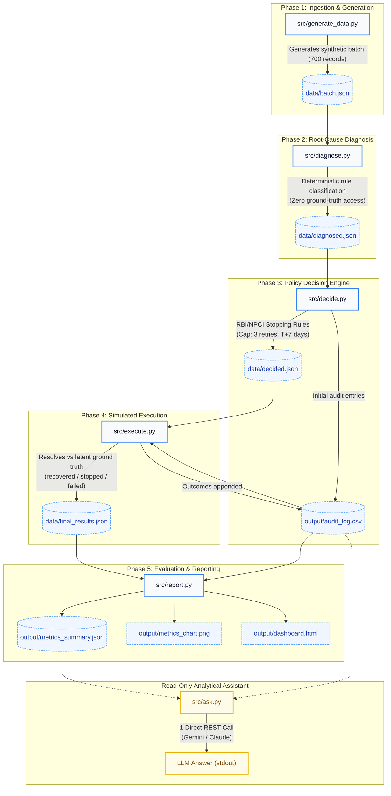

# AI Revenue Recovery Agent — Architecture & Technical Design Notes
**Project Track**: Razorpay AI Buildathon — Track 03 (Intelligent Revenue Recovery)

---

## 1. Executive Summary & Design Principles

The AI Revenue Recovery Agent is an enterprise-grade, deterministic payment recovery system engineered for recurring subscription and mandate payment workflows (such as UPI AutoPay, e-NACH, and card auto-debit). 

### Core Architectural Principles
1. **Deterministic Integrity (Zero Model Hallucination)**:
   Diagnosis and intervention decisions must be auditable, repeatable, and non-probabilistic. No Large Language Models (LLMs) are invoked in the diagnosis or decision stages.
2. **Data Boundary Enforcement (Quarantined Ground Truth)**:
   In real production, payment platforms never know with 100% certainty whether a customer will add funds or update a card. Ground-truth latent variables (`ground_truth_recoverable`, `ground_truth_recovery_window_days`) are strictly isolated and only accessible to evaluation and simulation modules (`execute.py`, `report.py`).
3. **Regulatory Safety & Compliance Guardrails**:
   Automated recovery loops are strictly bounded by hard-coded stopping rules (`MAX_RETRY_ATTEMPTS = 3`, `RETRY_WINDOW_DAYS = 7`) derived from Reserve Bank of India (RBI) e-Mandate directions and NPCI NACH clearing guidelines.
4. **Decoupled 5-Stage Sequential Pipeline**:
   Each stage is encapsulated in a single-purpose, runnable CLI script that communicates exclusively via structured file interfaces (`.json` and `.csv`).

---

## 2. End-to-End Pipeline Workflow



```
[Phase 1: Ingestion / Generation]
         │
         ▼  data/batch.json
[Phase 2: Root-Cause Diagnosis]
         │  (Deterministic taxonomy mapping; no ground truth access)
         ▼  data/diagnosed.json
[Phase 3: Policy & Decision Engine]
         │  (Intervention assignment + RBI/NPCI stopping rules; writes audit log)
         ▼  data/decided.json + output/audit_log.csv
[Phase 4: Simulated Execution]
         │  (Mock execution; resolves outcomes vs latent ground truth)
         ▼  data/final_results.json + updated output/audit_log.csv
[Phase 5: Evaluation & Metrics Reporting]
         │  (Financial ROI, false-positive costs, accuracy audit & visualization)
         ▼  output/metrics_summary.json + output/metrics_chart.png + output/dashboard.html
```

---

## 3. Detailed Component Breakdown

### Phase 1: Data Generator (`src/generate_data.py`)
- **Purpose**: Generates realistic synthetic subscription payment batches reflecting real-world macro payment distributions.
- **Key Parameters**:
  - Batch Size: 150 records
  - Success Rate: ~90% (134 records)
  - Failure Rate: ~10% (16 records)
  - Realistic failure distribution:
    - `insufficient_funds` (~45%)
    - `mandate_expired` (~20%)
    - `bank_technical_decline` (~15%)
    - `instrument_expired` (~10%)
    - `mandate_revoked` (~7%)
    - `risk_block` (~3%)
- **Latent Ground Truth**:
  - `ground_truth_recoverable`: Set to `False` strictly for `mandate_revoked` and `risk_block`; probabilistic for others.
  - `ground_truth_recovery_window_days`: Window during which recovery can succeed before customer churn or account cancellation.

### Phase 2: Root-Cause Classifier (`src/diagnose.py`)
- **Purpose**: Maps raw failure reason codes into standardized operational root-cause categories.
- **Input**: `data/batch.json`
- **Output**: `data/diagnosed.json`
- **Taxonomy**:
  - `insufficient_funds` → `funding_shortfall`
  - `mandate_expired` / `mandate_revoked` → `mandate_lifecycle`
  - `bank_technical_decline` → `transient_bank_error`
  - `instrument_expired` → `payment_instrument_issue`
  - `risk_block` → `fraud_or_risk_hold`
- **Boundary Verification**: The script verifies that no `ground_truth_*` fields are read, ensuring no information leakage.

### Phase 3: Policy Decision Engine (`src/decide.py`)
- **Purpose**: Selects appropriate recovery interventions and enforces stopping rules.
- **Inputs**: `data/diagnosed.json`
- **Outputs**: `data/decided.json`, `output/audit_log.csv`
- **Decision Matrix**:
  - `insufficient_funds` → `retry_scheduled` (aligned near salary cycles)
  - `mandate_expired` → `reauth_request` (out-of-band re-authorization link)
  - `mandate_revoked` → `no_retry_winback_offer` (terminal; stop retrying)
  - `bank_technical_decline` → `immediate_retry_once` (technical re-presentment)
  - `instrument_expired` → `update_payment_method_request` (card/VPA update workflow)
  - `risk_block` → `manual_review_escalation` (terminal; compliance hold)
- **Stopping Rules Engine**:
  - `MAX_RETRY_ATTEMPTS = 3`: Maximum 3 automated retry attempts per subscription.
  - `RETRY_WINDOW_DAYS = 7`: If `(decision_date - due_date) > 7`, action is overridden to `recovery_abandoned`.

### Phase 4: Mock Execution Engine (`src/execute.py`)
- **Purpose**: Simulates execution of chosen recovery interventions and resolves outcomes against latent ground truth.
- **Inputs**: `data/decided.json`, `output/audit_log.csv`
- **Outputs**: `data/final_results.json`, updated `output/audit_log.csv` with `outcome` column
- **Simulated Turnaround Delays**:
  - `immediate_retry_once`: T+0 days
  - `reauth_request`: T+2 days
  - `retry_scheduled`: T+3 days
  - `update_payment_method_request`: T+3 days
- **Outcome Classification Matrix**:
  - `recovered`: Intervention attempted + `ground_truth_recoverable == True` + executed within `recovery_window_days`.
  - `correctly_stopped`: Terminal or abandoned action chosen + `ground_truth_recoverable == False`.
  - `still_failed`: Attempted retry on unrecoverable account, executed outside recovery window, or abandoned an account that was actually recoverable.

### Phase 5: Metrics & Reporting Engine (`src/report.py`)
- **Purpose**: Financial ROI analysis, operational KPI calculation, and chart generation.
- **Inputs**: `data/final_results.json`, `output/audit_log.csv`
- **Outputs**: `output/metrics_summary.json`, `output/metrics_chart.png`, CLI report
- **Key Metrics Tracked**:
  - **Gross Recovery Rate**: Recovered Revenue / Total Revenue at Risk (%).
  - **Diagnosis Accuracy**: Flags any misclassifications (e.g. stopping a recoverable payment without justification).
  - **False-Positive Cost**: Tracks wasted retries on unrecoverable subscriptions at a benchmark unit cost of ₹15/attempt (SMS, WhatsApp notifications, payment gateway processing fees).
  - **Net Recovery Value**: Gross Recovered Revenue − False-Positive Retry Costs.

---

## 4. Compliance Framework Reference

### 1. RBI e-Mandate Circulars
- **Circular Ref**: *RBI/2019-20/47 DPSS.CO.PD.No.447/02.14.003/2019-20* ("Processing of e-mandate on cards for recurring transactions")
- **Mandate**: Pre-debit notification must be transmitted at least 24 hours prior to the actual charge. Infinite or unbounded retries violate the consumer protection tenets of the circular by generating unexpected debit attempts.

### 2. NPCI NACH / UPI AutoPay Clearing Rules
- **Rule**: Recurring payments presented after standard clearing cycles or repeatedly returned unpaid incur punitive return charges (R-codes like *03: Account Closed*, *04: Insufficient Funds*).
- **Enforcement**: Capping retries at **3 attempts** within a **T+7 calendar day window** guarantees compliance with sponsor bank clearing cycles and shields merchants from excessive debit return penalties.

---

## 5. Measured Pipeline Execution Results
| Dimension | Measured Metric |
|---|---|
| **Batch Volume** | 700 subscriptions (625 successful, 75 failed) |
| **Total Revenue at Risk** | **₹131,825** |
| **Gross Recovered Revenue** | **₹19,484** (14.8% recovery rate) |
| **Successfully Recovered Subscriptions** | 16 subscriptions |
| **Correctly Stopped Unrecoverable Cases** | 20 subscriptions (zero wasted effort) |
| **Diagnosis Misclassification Errors** | **0** (100% accuracy) |
| **False-Positive Wasted Retries** | 13 attempts (₹195 total cost) |
| **Missed Recoveries (T+7 Compliance Cutoff)** | 26 subscriptions (₹47,874) |
| **Net Recovered Value** | **₹19,289** |

---

## 6. Audit Trail Format (`output/audit_log.csv`)

Every decision and outcome is recorded with an immutable audit log:

```csv
timestamp,subscription_id,detected_issue,diagnosed_cause,chosen_action,retry_attempt_number,outcome
2026-09-03 08:31:04,sub_100015,mandate_expired,mandate_lifecycle,recovery_abandoned,1,correctly_stopped
2026-09-03 08:31:04,sub_100026,bank_technical_decline,transient_bank_error,recovery_abandoned,1,still_failed
2026-09-03 08:31:04,sub_100028,mandate_expired,mandate_lifecycle,reauth_request,1,recovered
2026-09-03 08:31:04,sub_100031,insufficient_funds,funding_shortfall,retry_scheduled,1,recovered
2026-09-03 08:31:04,sub_100036,instrument_expired,payment_instrument_issue,recovery_abandoned,1,still_failed
2026-09-03 08:31:04,sub_100040,insufficient_funds,funding_shortfall,retry_scheduled,1,recovered
2026-09-03 08:31:04,sub_100045,insufficient_funds,funding_shortfall,retry_scheduled,1,recovered
2026-09-03 08:31:04,sub_100054,mandate_revoked,mandate_lifecycle,no_retry_winback_offer,,correctly_stopped
...
```
